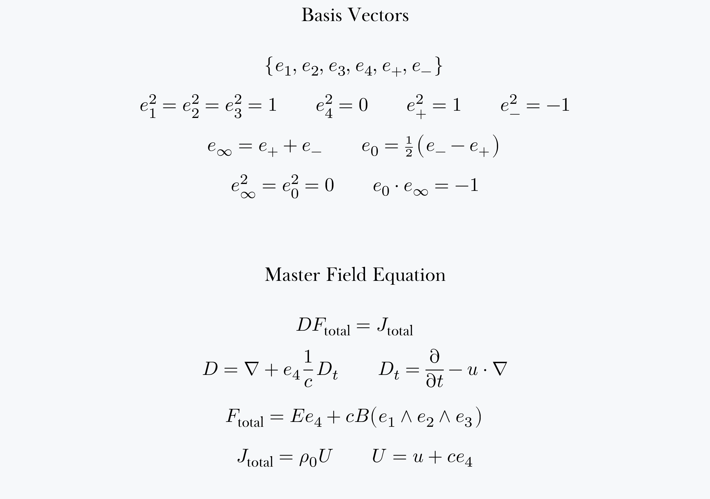

= Probabilistic numerical algorithms

These algorithms do the same thing that “quantum computers” are
supposed to do, but do so without superconductors or magic. “Quantum
computers” are _actually_ hybrids of analog and digital electronic
circuitry, and could be made of silicon operational amplifiers. It
makes far more sense, however, to have numerical analysts write
computer programs for parallel digital computers.

The reason these algorithms work is that James Clerk Maxwell had the
right intuition, and physics since Heaviside has gone completely off
the rails. _Maxwell’s_ equations are the only fundamental equations of
physics. Albert Einstein probably had an IQ much higher than mine, but
wasn’t as demanding of his theories. His theory was too ridiculous to
be true, so I sought one that was so compelling it could not be denied
(_abductive reasoning_). It is _not_ that the speed of light is always
the same. It is that electromagnetic waves obey Newton’s law of
inertia.

I have independently proven that “quantum” theory is a load of
rubbish. This is not difficult to do. Anyone with the slightest
_proper_ knowledge of linear spaces can see that Hilbert space is a
space of logical propositions, not of physical states. But it is more
than that. It is that Niels Bohr deliberately set “quantum” theory up
as a cult in which physicists were required to believe contradictory
propositions simultaneously, producing the same paralysis of cerebral
activity depicted in Orwell’s _Nineteen Eighty-Four_. This is why
electrical engineers are designing what are plainly hybrid computers
that can be made of operational amplifiers or linear CMOS, but instead
using Josephson junctions and superconducting magnets. The equation
above will give you the design, _if_ you use sane mathematical
techniques such as MaxEnt.

And this is why electrical engineers, physics graduates, and signal
processing graduates like me are even working on this nonsense at all.
It can be done by numerical analysts on parallel digital computers.

*I am a disabled person who could not handle the attention, so please
 do not bother me about all this. You can read my PDFs at
 https://archive.org/details/unified-field-theory*
