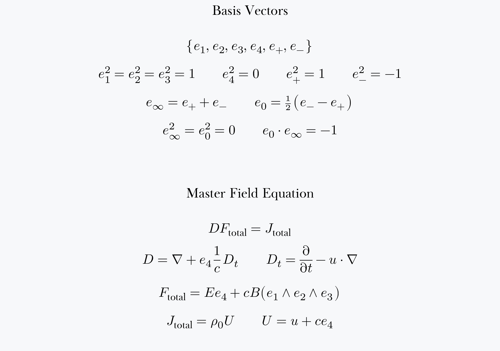

= Probabilistic numerical algorithms

NOTE: The Grover’s search algorithm in Ada, customized for AMD Zen 5
CPU, has successfully found an element, in an array of over 1 million,
in about 3 milliseconds. Shor’s algorithm, on the other hand, still
requires special hardware if it is going to break RSA-2048, whether it
be implemented shabbily as analog or properly as digital.

These algorithms do the same thing that “quantum computers” are
supposed to do, but do so without superconductors or magic. “Quantum
computers” are _actually_ hybrids of analog and digital electronic
circuitry, and could be made of silicon operational amplifiers. It
makes far more sense, however, to have numerical analysts write
computer programs for parallel digital computers.

The reason these algorithms work is that James Clerk Maxwell had the
right intuition, and physics since Heaviside has gone completely off
the rails. _Maxwell’s_ equations are the only fundamental equations of
physics. Albert Einstein probably had an IQ much higher than mine, but
wasn’t as demanding of his theories. His theory was too ridiculous to
be true, so I sought one that was so compelling it could not be denied
(_abductive reasoning_). It is _not_ that the speed of light is always
the same. It is that electromagnetic waves obey Newton’s law of
inertia.

]

Separately I have in many ways proven that “quantum” theory is a load
of rubbish. This is not difficult to do. Anyone with the slightest
_proper_ knowledge of linear spaces can see that Hilbert space is a
space of logical propositions, not of physical states. Furthermore,
Maxwell’s theory is explicitly one of no-action-at-a-distance, so is
completely incompatible with “quantum” theory. But the situation is
such that none of these proofs is likely to take hold. Niels Bohr
deliberately designed “quantum” theory as a cult in which physicists
were required to believe contradictory propositions simultaneously.
Thus modern “physics” produces the same paralysis of cerebral activity
depicted in Orwell’s _Nineteen Eighty-Four_.

Those physicists who admirably remained sane in spite of the abuse
they got, such as Albert Einstein, were ostracized.

The cult and its cerebral paralysis are now destroying the IEEE, of
which I am a senior member. This paralysis of the brain is why
electrical engineers are designing what are plainly hybrid computers
that can be made of operational amplifiers or linear CMOS, but instead
are using Josephson junctions and superconducting magnets. The equation
above will give you the design, _if_ you use sane mathematical
techniques such as MaxEnt.

However, why are electrical engineers, including signal processing
graduates like me, even working on this at all? It can be done by
numerical analysts on parallel digital computers. An ordinary mini-PC
with what is misnamed an “AI” CPU is an example of such a computer.

IMPORTANT: I AM A DISABLED PERSON WHO COULD NOT HANDLE THE ATTENTION,
+ SO PLEASE DO NOT BOTHER ME ABOUT ALL THIS. YOU CAN READ MY PDFS AT +
https://archive.org/details/unified-field-theory

Below is an aid for visualizing how radio and light waves travel
inertially, and thus why there is a unified field theory in which it
becomes easy to re-analyze “quantum” computers and redo the algorithms
digitally. It is a Python script to generate a GIF of an
animation.footnote:[The GIF’s bottom caption alludes to facile
arguments that were used against Walter Ritz’s proposed explanation,
similar to ours, of the Michelson-Morley experiment. Notice that,
because my education was not in physics per se, but in electrical
engineering, my intuition jumps to radio waves rather than “light
rays.” Thus I have an advantage over those who argued down Ritz’s
proposal: what my imagination leaps to _exists_. “Light rays”—and
“photons”—_do not exist_. Therefore arguments appealing to them,
either explicitly or implicitly, are pure nonsense.] The script
assumes you have a TeX installation. A good way to generate the GIF is

[.source,Shell]
----
python inertial_waves_batch.py
gifsicle --colors 256 -b -O3 inertial_waves.gif
----

[.source,Python]
----
#!/usr/bin/env python3
#
# inertial_waves_batch.py
#
# A program to help people visualize the Michelson-Morley effect.
#

import argparse
import sys
import numpy as np
import matplotlib
matplotlib.use('Agg', force=True)

# 1. DELEGATE ALL RENDERING TO SYSTEM TEX LIVE WITH DEFAULT SANS & EULER MATH
matplotlib.rcParams['text.usetex'] = True
matplotlib.rcParams['text.latex.preamble'] = r'''
\usepackage[T1]{fontenc}
\usepackage{eulervm}     % Overrides math engine to elegant AMS Euler
'''

import matplotlib.pyplot as plt
import matplotlib.animation as animation
from matplotlib.patches import Arc  # For rendering pure geometric wave arcs

def main():
    parser = argparse.ArgumentParser(
        description="Headless wave mechanics visualization engine.",
        formatter_class=argparse.ArgumentDefaultsHelpFormatter
    )
    parser.add_argument("output", nargs="?", default="inertial_waves.gif", help="Output file path destination")
    parser.add_argument("-f", "--frames", type=int, default=300, help="Total animation frame limits to evaluate")
    parser.add_argument("-r", "--fps", type=int, default=20, help="Output playback frames per second")
    parser.add_argument("-d", "--dpi", type=int, default=80, help="Resolution compression scale")
    args = parser.parse_args()

    fig, ax = plt.subplots(figsize=(12, 8))
    ax.set_xlim(-10, 20)
    ax.set_ylim(-10, 10)
    ax.set_aspect('equal')
    ax.axis('off')
    ax.set_facecolor('#0f0f1f')
    fig.patch.set_facecolor('#0f0f1f')

    # 2. CAPTION LINES WITH TRADITIONAL TEX QUOTES (COMPUTER MODERN SANS)
    caption_lines = [
        r"\textbf{UNIFIED FIELD THEORY}",
        "The EM field is the only field, and gravity is an electromagnetic effect.",
        "The Michelson-Morley effect is due to INERTIA OF ELECTROMAGNETIC WAVES.",
        "Because light consists of waves, ALL ARGUMENTS MUST INVOKE WAVE MECHANICS.",
        r"(No naive counterarguments about ``light rays'' overtaking one another, etc.)"
    ]
    
    start_y = 0.16           
    line_spacing = 0.030     
    
    for i, line in enumerate(caption_lines):
        current_y = start_y - (i * line_spacing)
        current_size = 15 if i == 0 else 14
        
        # REFACTOR: Completely removed pure white. Upper title is now soft #888888.
        current_color = '#888888' if i == 0 else '#5a5a75'
            
        fig.text(
            0.5, current_y,
            line,
            color=current_color,
            fontsize=current_size,
            ha='center',
            va='bottom'
        )

    # 3. MASTER FIELD EQUATION LINE-BY-LINE LEADING LOOP (TRUE NORTHWEST PIN)
    formula_lines = [
        r"\textbf{Master Field Equation}",
        r"$D F_{\mathrm{total}} = J_{\mathrm{total}}$",
        r"$D = \nabla + e_4 \frac{1}{c} D_t \quad D_t = \frac{\partial}{\partial t} - u \cdot \nabla$",
        r"$F_{\mathrm{total}} = E e_4 + c B (e_1 \wedge e_2 \wedge e_3)$",
        r"$J_{\mathrm{total}} = \rho_0 U \quad U = u + c e_4$"
    ]
    
    fig_math_start_y = 0.95
    fig_math_spacing = 0.038       
    
    for i, formula in enumerate(formula_lines):
        current_math_y = fig_math_start_y - (i * fig_math_spacing)
        fig.text(0.02, current_math_y, formula, color='#a0c0ff', fontsize=14, va='center', ha='left')

    # 4. TWO-LINE STATIC EXPERIMENT CAPTION (ENLARGED TYPOGRAPHY & SHIFTED LEFT)
    experiment_lines = [
        "A radio transmitter emitting oil droplets, and a Michelson--Morley experiment,",
        "moving inertially in outer space."
    ]
    
    caption_start_y = fig_math_start_y
    caption_spacing = 0.035
    
    for i, line in enumerate(experiment_lines):
        current_caption_y = caption_start_y - (i * caption_spacing)
        fig.text(
            0.36, current_caption_y,  
            line, 
            color='#888888', 
            fontsize=15,       
            va='center', 
            ha='left'
        )

    # Physics Constants
    v_source = 1.5
    wave_speed = 3.0
    mm_x, mm_y = 4.0, -4.0
    mm_arm_length = 3.0

    wavefronts = []
    droplets = []
    active_artists = []

    scat_droplets = ax.scatter([], [], s=8, color='#ffaa44')

    def update(frame):
        nonlocal droplets, active_artists  

        for artist in active_artists:
            artist.remove()
        active_artists.clear()

        t = frame * 0.05
        x_source = -8.0 + v_source * t
        y_source = 3.0

        if x_source <= 20.0:
            if frame % 15 == 0:
                wavefronts.append({'t0': t, 'x0': x_source, 'y0': y_source})

            if frame % 12 == 0:
                for angle in np.linspace(0, 2*np.pi, 6, endpoint=False):
                    droplets.append({
                        'x': x_source, 'y': y_source,
                        'vx': 0.8 * np.cos(angle) + v_source,
                        'vy': 0.8 * np.sin(angle), 'alpha': 0.6
                    })

            tx_dot, = ax.plot(x_source, y_source, 'o', color='#888888', markersize=10)
            active_artists.append(tx_dot)

        surviving_droplets = []
        scatter_coords = []
        scatter_alphas = []

        for d in droplets:
            d['x'] += d['vx'] * 0.05
            d['y'] += d['vy'] * 0.05
            d['alpha'] -= 0.005

            if d['alpha'] > 0.01:
                surviving_droplets.append(d)
                scatter_coords.append([d['x'], d['y']])
                scatter_alphas.append(d['alpha'])

        droplets = surviving_droplets

        if scatter_coords:
            scat_droplets.set_offsets(scatter_coords)
            scat_droplets.set_alpha(scatter_alphas)
        else:
            scat_droplets.set_offsets(np.empty((0, 2)))

        for wf in wavefronts:
            radius = wave_speed * (t - wf['t0'])
            if 0 < radius < 25:
                cx = wf['x0'] + v_source * (t - wf['t0'])
                circle = plt.Circle((cx, wf['y0']), radius, color='#00ffcc', fill=False, alpha=max(0.1, 1.0 - radius/25.0), lw=1.5)
                ax.add_patch(circle)
                active_artists.append(circle)

        current_mm_x = mm_x + v_source * t
        mm_base, = ax.plot(current_mm_x, mm_y, 's', color='#888888', markersize=12)
        
        # Faint, thin lines marking the geometry of the apparatus arms
        mm_arm1, = ax.plot([current_mm_x, current_mm_x + mm_arm_length], [mm_y, mm_y], color='#3a3a4e', lw=0.75)
        mm_arm2, = ax.plot([current_mm_x, current_mm_x], [mm_y, mm_y + mm_arm_length], color='#3a3a4e', lw=0.75)
        active_artists.extend([mm_base, mm_arm1, mm_arm2])

        cycle_t = t % 2.0
        if cycle_t < 1.0:
            p_long_x = current_mm_x + (cycle_t * mm_arm_length)
            p_long_y = mm_y
            p_trans_x = current_mm_x
            p_trans_y = mm_y + (cycle_t * mm_arm_length)
            
            long_theta1, long_theta2 = -90, 90
            trans_theta1, trans_theta2 = 0, 180
        else:
            p_long_x = current_mm_x + ((2.0 - cycle_t) * mm_arm_length)
            p_long_y = mm_y
            p_trans_x = current_mm_x
            p_trans_y = mm_y + ((2.0 - cycle_t) * mm_arm_length)
            
            long_theta1, long_theta2 = 90, 270
            trans_theta1, trans_theta2 = 180, 360

        arc_l = Arc((p_long_x, p_long_y), 0.6, 0.6, angle=0, theta1=long_theta1, theta2=long_theta2, color='#00aaff', lw=1.5)
        arc_t = Arc((p_trans_x, p_trans_y), 0.6, 0.6, angle=0, theta1=trans_theta1, theta2=trans_theta2, color='#00aaff', lw=1.5)
        
        ax.add_patch(arc_l)
        ax.add_patch(arc_t)
        active_artists.extend([arc_l, arc_t])

        return []

    anim = animation.FuncAnimation(fig, update, frames=args.frames, interval=1000//args.fps, blit=False)
    writer = animation.PillowWriter(fps=args.fps)
    anim.save(args.output, writer=writer, dpi=args.dpi)

if __name__ == "__main__":
    main()
----
